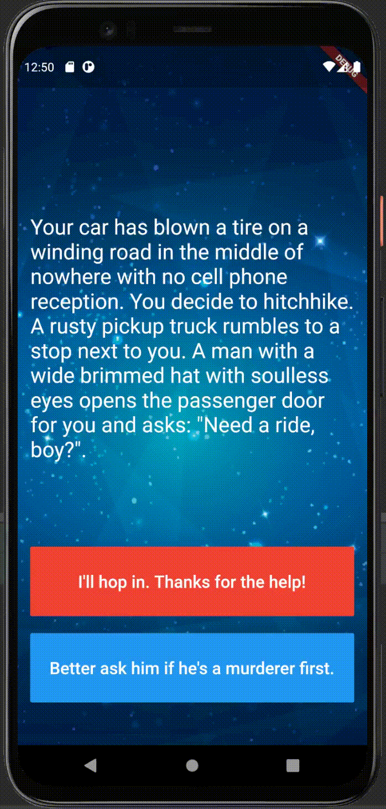

# Destini 🤔

This is a choices game where you can act the way you want to act and your choices can change the whole story line.

Current story:
Annalise and her journey to find her one true love.

## Objectives

This is one of the challenges from Flutter course. In this challenge, I will be building a choose your own adventure game like Bandersnatch. 

In the process, I apply my knowledge from the last module (Quizzler) to use Dart OOP principles to build a well organised project.

Below is the first version of the application based on the challenge's tutorial.

After finishing the challenge, I edited and updated the application by applying what I have learnt from all previous lessons.

<a href="https://www.freepik.com/vectors/building">Building vector created by studiogstock - www.freepik.com</a>

